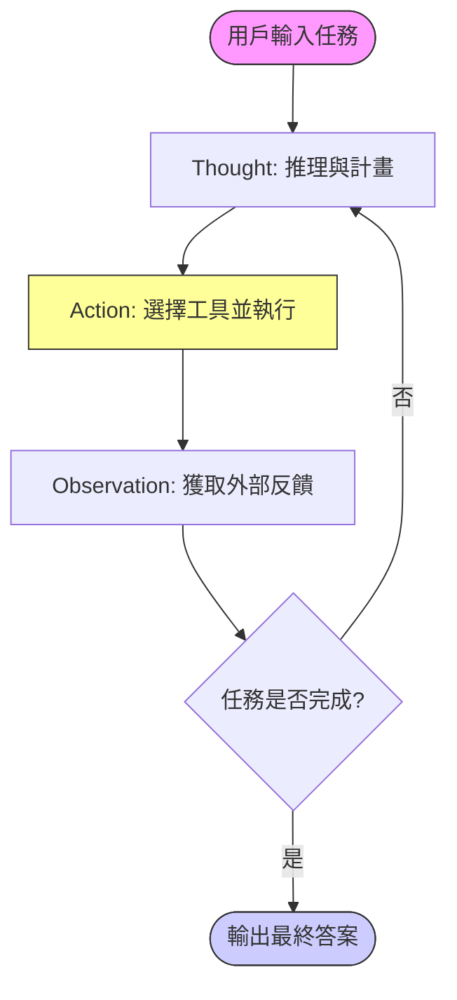

# ReAct-Agent

ReAct (Reasoning and Acting) 是一個結合了「推理」與「行動」的 AI 代理框架，讓大語言模型 (LLM) 能夠像人類一樣解決複雜任務。

---

## 🎯 核心理念：T-A-O 循環

ReAct 的核心在於將執行的過程拆解為三個不斷循環的步驟：

1.  **Thought (推理)**：模型先解釋「為什麼」要這麼做。這能幫助模型拆解複雜問題並追蹤任務進度。
2.  **Action (行動)**：模型根據推理決定執行具體的動作（例如：調用搜尋引擎、查看文件、執行 Python 程式碼）。
3.  **Observation (觀察)**：執行動作後獲得的外部反饋。模型會根據這個觀察進入下一個思維循環。

---

## 🧩 技術選型：OpenAI SDK 介紹

本專案採用 `openai` 官方 Python SDK 來與 **MiniMax 國際版** 進行通訊。

### 為什麼選擇 OpenAI SDK？
雖然我們使用的是 MiniMax 的模型，但 MiniMax 提供了「OpenAI 兼容接口」。使用 SDK 的優點包括：
- **跨平台兼容**：未來若想切換到 GPT-4 或 Claude (經由 LiteLLM 等代理)，只需更改 `base_url` 與 `api_key`。
- **簡化開發**：自動處理 JSON 封裝與 HTTP Header，並提供完善的型別提示。
- **穩定性**：內建錯誤處理與連線管理。

### 基本用法說明

在 `main.py` 中，我們透過以下方式初始化並調用：

```python
from openai import OpenAI

# 1. 初始化客戶端：設定端點與金鑰
client = OpenAI(
    api_key="您的金鑰",
    base_url="https://api.minimax.io/v1" # MiniMax 兼容端點
)

# 2. 進行對話調用
response = client.chat.completions.create(
    model="Minimax-M2.5",
    messages=[{"role": "user", "content": "你好！"}]
)

# 3. 獲取內容
print(response.choices[0].message.content)
```

---

## 📊 系統流程圖

> 📦 **預覽須知**：本圖使用 Mermaid 語法繪製。若在 VS Code 中看不到圖示，
> 請安裝擴充套件 [Markdown Preview Mermaid Support](https://marketplace.visualstudio.com/items?itemName=bierner.markdown-mermaid)
> （搜尋 `bierner.markdown-mermaid`）後，重新開啟 Markdown Preview 即可正常顯示。



---

## 🛠️ 開發環境

本專案運行於 WSL (Ubuntu 22.04) 環境。

- **Python 版本**: 3.12 (參考 `.python-version`)
- **Shell**: Bash / PowerShell 7

---

## 🚀 快速開始 (Quick Start)

本專案建議在 WSL (Ubuntu 22.04) 環境下運行。

### 1. 環境準備

首先，確保您的系統已安裝 `python3-pip` 與 `python3-venv`：

```bash
sudo apt update
sudo apt install python3-pip python3-venv -y
```

### 2. 建立虛擬環境與安裝依賴

```bash
# 建立虛擬環境
python3 -m venv .venv

# 啟動虛擬環境
source .venv/bin/activate

# 安裝必要套件
pip install -r requirements.txt
```

### 3. 設定環境變數

將 `.env.example` 複製為 `.env` 並填入您的 MiniMax API Key：

```bash
cp .env.example .env
```

請確保 `.env` 內包含以下正確格式：
- `MINIMAX_API_KEY`: 您的 API 金鑰。
- `MINIMAX_BASE_URL`: `https://api.minimax.io/v1`
- `MINIMAX_MODEL`: `Minimax-M2.5` (注意大小寫與點點)

### 4. 執行 Agent

```bash
python3 main.py
```

---

## � 執行結果範例 (Execution Example)

以下是執行 `main.py` 後的真實終端機輸出，展示了 Agent 如何透過「思考、行動、觀察」循環完成任務：

```text
🚀 啟動任務: 找出目前台灣總統是誰，並計算他在 2030 年時幾歲。

--- 步驟 1 ---
🤔 Thought: 用戶想了解台灣現任總統是誰以及計算他到2030年的年齡。我需要先搜尋台灣現任總統的資訊。
⚡ Action: web_search('台灣現任總統是誰 2024')
   🔎 [執行搜尋]: 台灣現任總統是誰 2024
👁️ Observation: 2024年5月20日起，台灣總統為賴清德 (賴清德出生於1959年)。

--- 步驟 2 ---
🤔 Thought: 已經獲得台灣現任總統的資訊。賴清德出生於1959年，需要計算他在2030年時的年齡。
⚡ Action: calculator('2030 - 1959')
   🧮 [執行計算]: 2030 - 1959
👁️ Observation: 71

--- 步驟 3 ---

✅ 任務完成！
Final Answer: 台灣現任總統是賴清德，他出生於1959年。到2030年時，他將會是71歲。
```

---

## �🛠️ 常見問題與解決方案 (Troubleshooting)

### Q1: 安裝套件時出現 `externally-managed-environment`
**原因**：Ubuntu 22.04+ 為了保護系統 Python，不允許直接使用 `pip` 安裝套件。
**解決**：請務必使用上述的「建立虛擬環境 (venv)」步驟進行操作。

### Q2: API 報錯 `unknown model 'minimax-m2-5'`
**原因**：MiniMax 模型的命名規範較為嚴格。
**解決**：
- ❌ 錯誤：`minimax-m2-5` 或 `minimax-m2.5`
- ✅ 正確：**`Minimax-M2.5`** (首字母大寫，中間使用小數點 `.`)

### Q3: Mermaid 圖表無法顯示
**原因**：VS Code 預設不支持網頁版 Mermaid 語法。
**解決**：請安裝 `bierner.markdown-mermaid` 擴充套件並重新載入。

---

<!-- [😸WSL] -->
<!-- [😸SAM] -->

